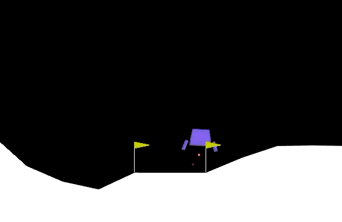

# Soft-DQN（离散动作空间 · 最大熵 DQN）



## 简介

基于 PyTorch + Gymnasium，面向**单维度离散动作空间**（如 CartPole-v1、LunarLander-v3、MountainCar-v0）的 Soft-DQN 实现。

"Soft" 指使用**软贝尔曼方程（最大熵 / Soft Q-Learning 思想）**代替普通 DQN 的硬 max 目标，并引入 SAC 式的**温度系数 α 自动调节**。代码主要包含以下组件：

| 组件 | 说明 |
|---|---|
| 软贝尔曼目标 | `V_soft(s') = α·logsumexp(Q(s',·)/α)`，把"取最大"换成带温度的软最大化 |
| Clipped Double-Q | 两个 Q 网络，目标取 `min(Q1, Q2)` 抑制过估计 |
| Dueling 结构 | 价值头 + 优势头（`Q = V + (A − mean A)`） |
| Softmax 策略 | 训练时按 `π(a|s) ∝ exp(Q(s,a)/α)` 采样，温度 α 控制探索强度 |
| α 自动调节 | 目标熵约束 + 闭式熵，Adam 更新 `log_alpha` |
| ε 安全网 | 极小的 ε（默认 0.02）随机动作，防止策略过早陷入局部最优 |

## 算法要点

**策略**（温度越高越均匀，越低越贪心）：

```
π(a|s) = softmax(Q(s,·)/α)
```

**软目标**（离散 SQL 备份，含 Clipped Double-Q）：

```
V_soft(s') = α · logsumexp( min(Q1(s',·), Q2(s',·)) / α ) · (1 − done)
target     = r + γ · V_soft(s')
```

当 α → 0 时退化为普通 DQN 的硬 max 目标；α 越大，"soft" 程度越高。

**温度自动调节**（SAC 风格）：给定目标熵 `H̄`，用当前策略的闭式熵调节 α：

```
alpha_loss = α · ( E_s[H(π(·|s))] − H̄ )
```

- 策略熵低于目标 → alpha_loss < 0 → α 上升（软化策略、加强探索）；
- 策略熵高于目标 → alpha_loss > 0 → α 下降（收紧策略）;
- 目标熵设置的大：策略平，偏探索；目标熵设置的小：策略尖，偏利用;
- 稀疏奖励、需要长期被迫探索的环境 可以用较大的目标熵.

## 环境依赖

项目在以下环境验证通过（`main.py` 头部有同样说明）：

```
python      3.11.15
torch       2.13.0.dev20260611+cu132   （需安装 Nightly 版以支持 RTX 5060 等新显卡）
gymnasium   1.3.0
numpy / tensorboard
```

50 系/40 系等新显卡若用旧版 PyTorch 报 CUDA 错误，请安装 Nightly：

```bash
pip3 install --pre torch torchvision --index-url https://download.pytorch.org/whl/nightly/cu132
pip install gymnasium tensorboard
```

## 目录结构

```
Soft-DQN/
├── agent.py     # 智能体：双 Q 网络、回放池、软目标、α 自动调节、保存/加载
├── net.py       # 网络：Dueling 结构 Q 网络（正交初始化）
├── train.py     # 训练流程：交互、预热、更新、周期评估、最优模型保存
├── test.py      # 测试流程：加载模型并评估
├── main.py      # 入口：参数解析，切换训练/测试模式
├── utils.py     # 工具：评估函数、随机种子、参数写入等
├── model/       # 训练产物：best / trained 模型（.pth）
├── runs/        # TensorBoard 日志（含 training_parameters.txt）
└── Soft-DQN_LunarLander-v3.gif   # LunarLander-v3 效果动图
```

## 快速开始

**训练**（默认 LunarLander-v3，CUDA）：

```bash
python main.py --is_test_mode 0 --env_name "LunarLander-v3"
```

**测试指定模型**（渲染窗口）：

```bash
python main.py --is_test_mode 1 --env_name "LunarLander-v3" \
    --load_name1 trained_130000_Q1.pth --load_name2 trained_130000_Q2.pth
```

不弹窗口只输出分数，加 `--is_human_render 0`。

**查看训练曲线**（新开终端）：

```bash
tensorboard --logdir=runs/LunarLander-v3
```

模型中默认保存位置：`./model/{env_name}/`，包含：

- `best_scores_*_Q1/Q2.pth`：评估得分最高的模型；
- `trained_{更新次数}_Q1/Q2.pth`：按 `--save_interval` 定时保存的快照。

## 关键超参数

| 参数 | 默认值 | 说明 |
|---|---|---|
| `--env_name` | LunarLander-v3 | CartPole-v1 / LunarLander-v3 / MountainCar-v0 |
| `--gamma` | 0.99 | 折扣因子 |
| `--lr` | 5e-4 | Q 网络学习率 |
| `--lr_alpha` | 5e-4 | 温度系数 α 的学习率 |
| `--epsilon` | 0.02 | ε 安全网（极小随机探索） |
| `--warmup_steps` | 5000 | 先用随机动作积累经验 |
| `--max_env_steps` | 1_000_000 | 环境最大总步数 |
| `--train_frequency` | 4 | 每 4 个环境步更新一次 |
| `--batch_size` | 256 | 采样批大小 |
| `--buffer_max_len` | 1_000_000 | 经验回放池容量 |
| `--update_tau` | 0.01 | 目标网络软更新系数 |
| `--clip_norm` | 1.0 | 梯度裁剪阈值 |
| `--hidden_dim` | 256 | 隐藏层维度 |
| `--eval_interval` | 1000 | 每更新 N 次评估一次 |
| `--save_interval` | 5000 | 每更新 N 次保存一次模型 |

目标熵在 `agent.py` 的 `Soft_DQN_Agent.__init__` 中设置：

```python
self.target_entropy = 0.5 * math.log(action_dim)   # 推荐工作区 0.3 ~ 0.7 · log|A|
# self.target_entropy = 0.98 * math.log(action_dim)   # 不推荐：接近最大熵，见注意事项
```

## 训练注意事项（踩坑记录）

1. **目标熵不要贴近 `log|A|`（最大熵）**：如取 `0.98·log|A|`，满足约束只能靠 α → ∞，而 α 又通过软目标给奖励注入约 `α·log|A|` 的膨胀项，形成"α 增大 → Q 膨胀 → α 被迫继续增大"的正反馈，导致 α 撞上限、Q 值发散、成绩崩溃。推荐取 `0.3 ~ 0.7` 倍 `log|A|`，α 会收敛到有限小值，训练稳定。
2. **保留 α 的上下限保护**：`alpha_min / alpha_max` 已内置在构造参数中，可在 `update()` 里对 `log_alpha` 做 clamp，防止 α → 0 时 `Q/α` 数值溢出。
3. **α 损失的 logπ 必须用完整动作 logits**（`[B, A]`），不能用 `gather` 后的标量 Q（`[B, 1]`），否则 `log_softmax` 只有一列、按动作索引 gather 必然越界（CUDA device-side assert），且单值 log_softmax ≡ 0，α 无法自适应。
4. **熵的度量用闭式熵**：`H(s) = −Σ_a π(a|s)·log π(a|s)`，无需对旧动作采样，避免回放池 off-policy 偏差导致 α 漂移。
5. **训练时 `explore=True`（Softmax 采样），评估时 `explore=False`（argmax）**：`evaluate_agent` 内部自动切换，最终成绩取决于 Q 质量。

## 实验结果（参考）

- `target_entropy = 0.5·log(4)` 配置下，LunarLander-v3 训练约 14 万环境步后平均奖励可达 **~240 分**（超过 200 分即视为解决），α 收敛到 ~0.05 的小值，熵稳定在目标附近；
- 动图即训练完成后策略的实录。

## 参考

- Haarnoja et al., *Reinforcement Learning with Deep Energy-Based Policies*（Soft Q-Learning, ICML 2017）
- Haarnoja et al., *Soft Actor-Critic: Off-Policy Maximum Entropy Deep RL*（SAC 温度自动调节）
